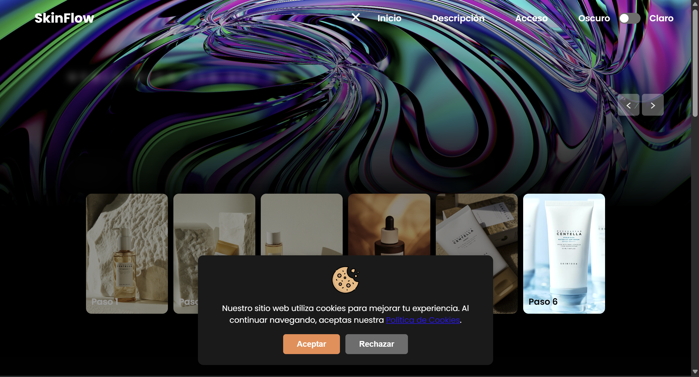
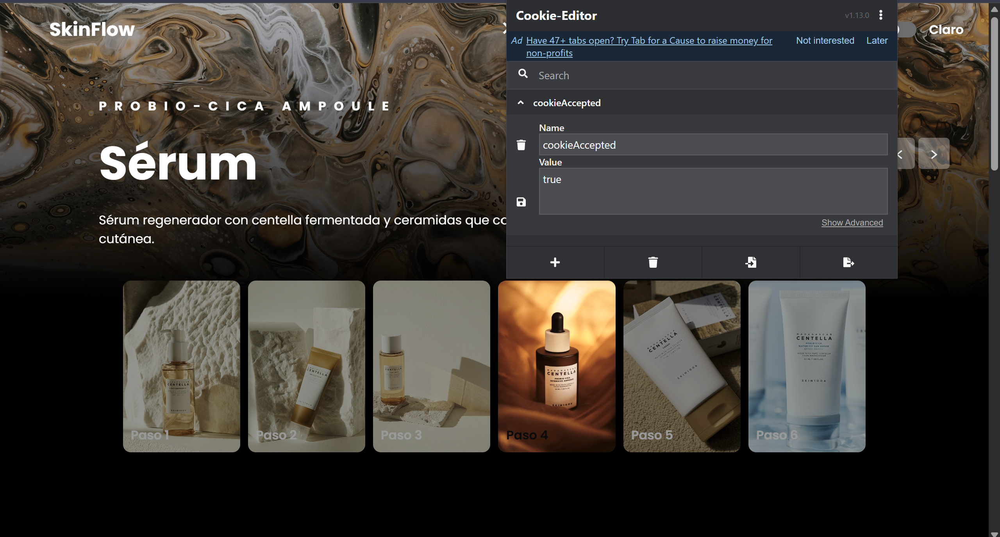
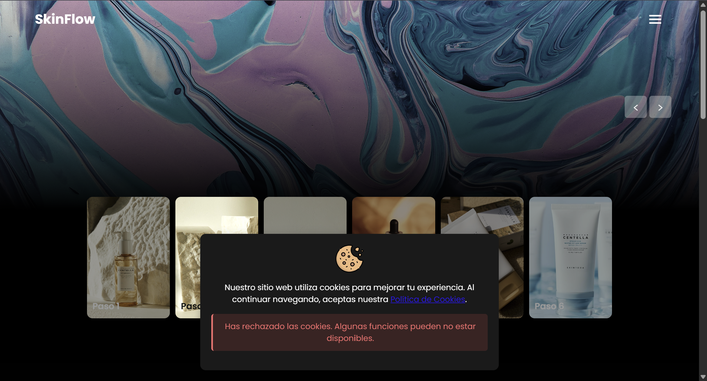
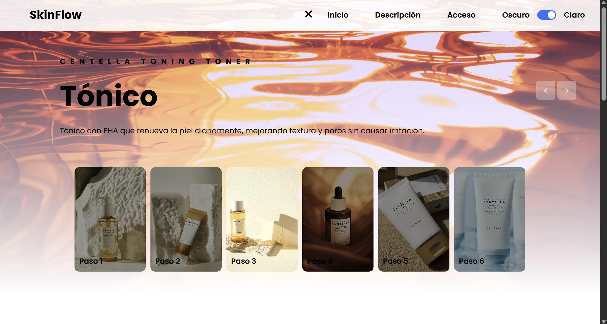
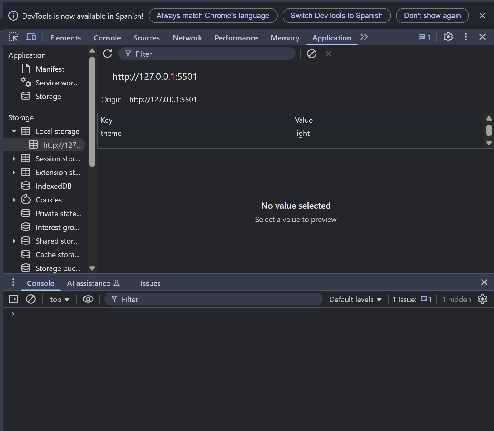
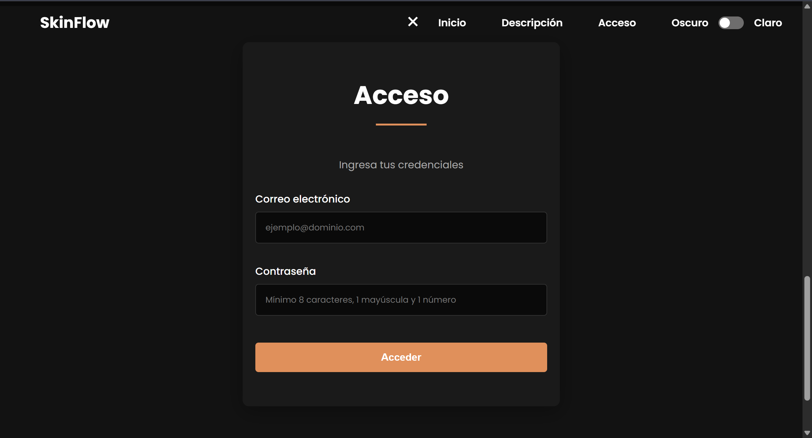
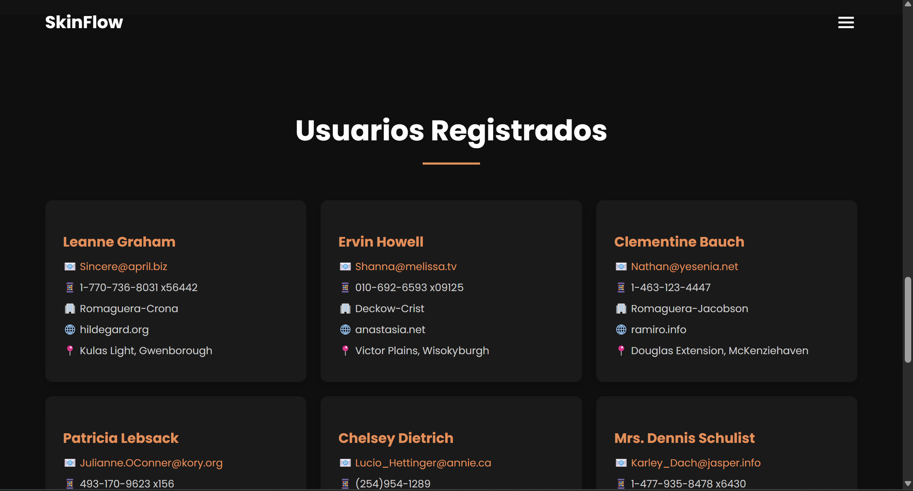

# ✨ SkinFlow

**SkinFlow** es una página web que presenta una rutina diaria de cuidado facial con productos de la marca **SKIN1004**.  
Puedes ver el resultado en el navegador usando el siguiente enlace: [**skinflow.netlify.app**](https://skinflow.netlify.app/).

Las imágenes de los productos fueron obtenidas de su [web oficial](https://www.skin1004.com/) y de [Pexels](https://www.pexels.com/es-es/).

## Funcionalidades principales 🚀
- **Menú hamburguesa interactivo**: abre/cierra el menú y navega entre secciones.
- **Modal de alerta de cookies**: opción de aceptar o rechazar cookies.
- **Modo oscuro/claro**: con guardado de preferencia en `localStorage`.
- **Formulario de acceso**: validación de email y contraseña para acceder a contenido privado.
- **Carga dinámica de usuarios**: tras login correcto, carga de datos desde una API externa.

## Secciones de la página 📄
- **Inicio**  
- **Descripción**  
- **Formulario**  
- **Usuarios** (accesible tras login)  
- **Footer**

## Detalles de funcionamiento ⚙️

- **Menú hamburguesa 🍔**  
  - Se abre/cierra al hacer clic.
  - Se cierra automáticamente al seleccionar una opción.
  - Cada opción navega a una sección.  
  

- **Modal de cookies 🍪**  
  - Aparece al cargar la web.
  - Permite aceptar o rechazar cookies.
  - Si se rechaza, muestra mensaje informativo.  
  
  
  

- **Modo oscuro/claro 🌗**  
  - Botón para alternar el tema.
  - Preferencia guardada en `localStorage`.  
  
  

- **Formulario de acceso 📝**  
  - **Validaciones**:
    - Email debe tener formato válido.
    - Contraseña debe tener mínimo 8 caracteres, una mayúscula y un número.
  - **Credenciales para acceso**:
    - Usuario: `user@lasalle.com`
    - Contraseña: `Hola1234`  
  

- **Carga de datos desde API externa 📡**  
  - Si el login es correcto, se cargan usuarios desde:  
    [https://jsonplaceholder.typicode.com/users](https://jsonplaceholder.typicode.com/users)
  - Si los datos son incorrectos, se muestra mensaje de error.  
  
